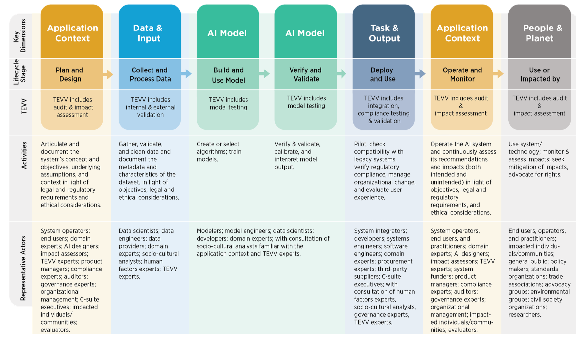
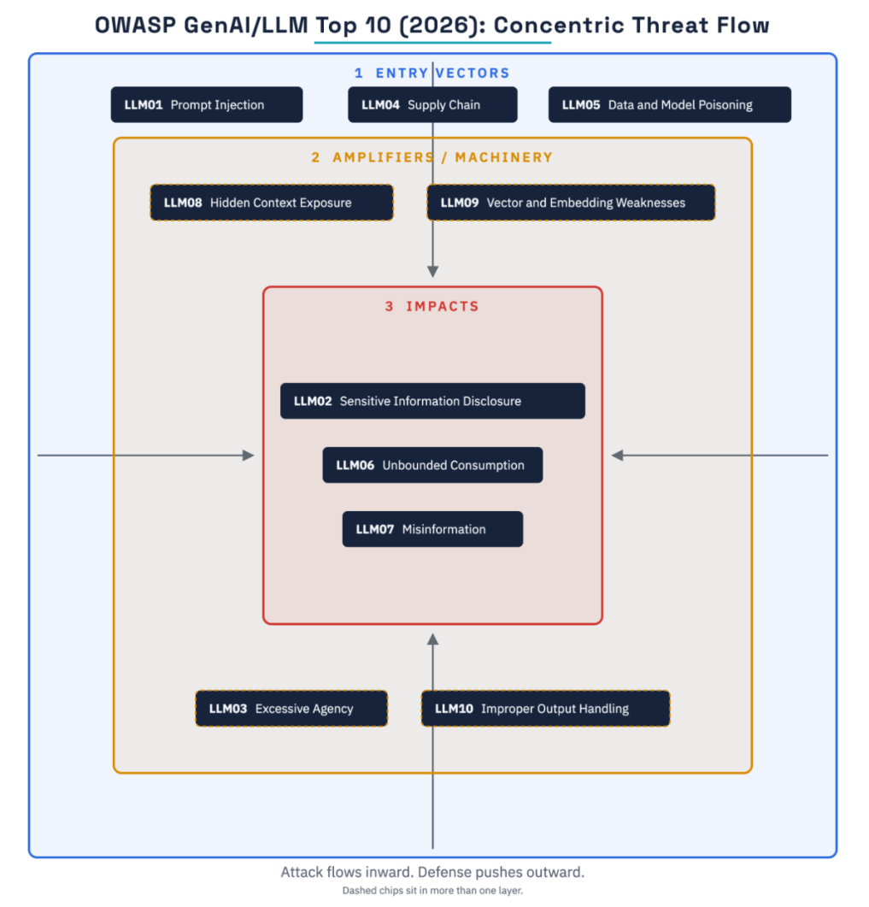

As agents become more embedded in organisations and undertake active roles in production applications, having ways to assess the potential risks they can expose you to is crucial as we increase our reliance on them. Whilst the probabilistic nature of LLMs can create uncertainty in their actions, by building the right mechanism to evaluate them you can quantify the risks of this happening.

There are plenty of established risk management frameworks such as NIST CSF, ISO 27001, SOC 2, alongside industry specific regulation such as DORA for financial institutions, or frameworks such as GAMP 5 for IT in pharma and life sciences. However, with the constant advances in frontier models accelerating what's possible with LLMs, regulation is far behind where it needs to be to help protect businesses and their customers.

This was emphasised in a conversation I recently had with a friend in the healthcare sector, whose company had been able to massively scale by using LLM-based agents instead of hiring staff for customer support. 

They'd followed all regulations to the letter, but also found them severely lacking with respect to the roles agents could take in dealing with customers. This grey area provided them with the opportunity to use agents for customer-facing tasks.

In these types of scenarios, being able to capture the right evidence as LLMs become embedded into applications is vital at this stage, not only to help mitigate the risk of working with LLMs, but also to ensure you're ready for when regulations catch up. Fortunately there are emerging guidelines and standards that can help, which I outline below.

## AI risk categories

We can categorise AI-specific risk into two categories — those which are established, but accelerated with LLMs and those which are new. 

These accelerated risks are those covered by cyber and infosec practices, but can become amplified in organisations via LLMs. For instance, with code being shipped by agents:

- Do you have the right guardrails in place to ensure they respect security and privacy practices?
- Are there mechanisms in place to ensure they cannot spin up new endpoints which provide access to sensitive data without the correct access controls in place? 
- Can they commit code or push to production without some human oversight? 

These types of controls are standard parts of good infosec and development practices, but the scale at which change can happen with LLMs is unprecedented. Do you have the right controls in place to ensure there are checkpoints that prevent agents being able to do too much without proper oversight? These risks are more pronounced if there are individuals without engineering backgrounds in the mix driving the work of agents.

LLMs then bring their own unique challenges, driven by their non-deterministic nature.

This includes hallucinations, prompt injection, tool misuse, sharing private information and potentially infringing on intellectual property.

There are other risks such as vendor risk if you're using models from external vendors, or conversely if you're running or training them in house, this may bring its own set of challenges. 

## De-risking LLMs

Beyond coping with the scale challenges that the usage of LLMs brings for production operations, one can quantify LLM-specific risks with the right evaluations (evals) in place.

I've written in more depth about evals for regulated industries [previously](/writing/building-an-evals-framework-for-audits/), but what makes them such a crucial tool in the context of risk management for agentic applications, is that they enable you to capture and evaluate LLM interactions in production operations. 

This enables you to track and assign risk scores to certain behaviours based on real-life observations both during their development and once live in production.

For instance, in evaluating documents against a regulatory corpus, we track false negative rates and how frequently citations are invented. The latter is a hallucination metric we capture on every evaluation run.

With the right evaluation harness in place, interactions with LLMs will be captured as you configure the model for your specific use case. These configurations only reach production once they've passed the thresholds you've set within your organisation.

Once in production, LLM observability and tracing tools can be used to capture and evaluate behaviour of your agents. Unexpected behaviours or failures can then be fed back into your evaluation harness creating a feedback loop for your agentic applications.

This provides you with the quantifiable metrics you need to assess prospective risks identified with the LLMs during development, alongside observed risks seen in your production applications. 

## Industry standards

The importance of evaluating LLM risk is prominent in the emerging standards and frameworks created specifically for AI use cases. 

[NIST's AI Risk Management Framework](https://www.nist.gov/itl/ai-risk-management-framework) (AI RMF) has test, evaluation, verification and validation (TEVV) tasks throughout the design, development and deployment of AI systems.  

*Test, evaluation, verification and validation (TEVV) is a core component of NIST's AI Risk Management Framework (source: NIST AI RMF 1.0, Fig. 3)*

The [AIUC-1 standard](https://www.aiuc-1.com/) for AI agent security, safety and reliability was created with input from over 100 Fortune 500 CISOs. The purpose of AIUC-1 is to provide a framework equivalent to HITRUST, SOC 2 and ISO 27001 for AI applications, which complements other standards such as the EU AI Act and ISO 42001. 

As with NIST's AI RMF, the evaluation of AI systems is a key component of the AIUC-1 standard, with [quarterly evaluations](https://www.aiuc-1.com/evidence/third-party) required from third parties to obtain and remain compliant. This includes adversarial evaluations, which should incorporate those security risks highlighted by [OWASP's Top 10 for LLM Applications](https://genai.owasp.org/resource/owasp-genai-llm-top-10-2026/). 

*The LLM application attack surface (source: OWASP Gen AI Top 10 2026, Fig. 2)*

Evaluations are key in measuring misinformation from models, prompt injection vulnerabilities and the trustworthiness of vendor models.

These standards illustrate how central evaluation is to reducing the risks associated with LLMs. 

Regardless of how the underlying models evolve, having the right environment in place to evaluate models and configure them for your specific use case is key to quantifying the risks they can expose your business to.

Without this, you are at the mercy of the model providers and the non-determinism of their output. 
